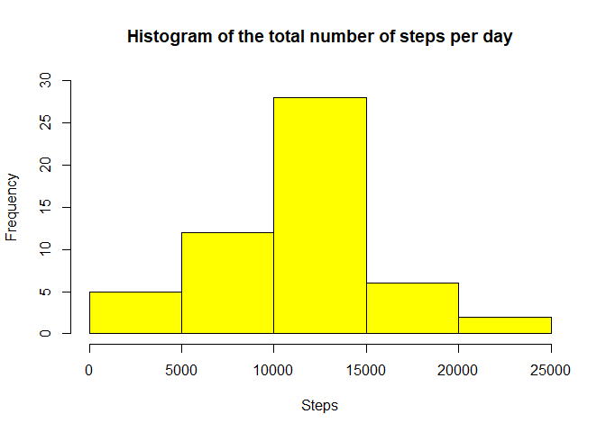
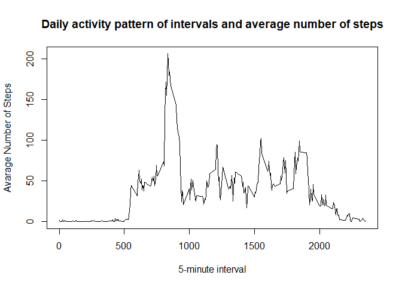
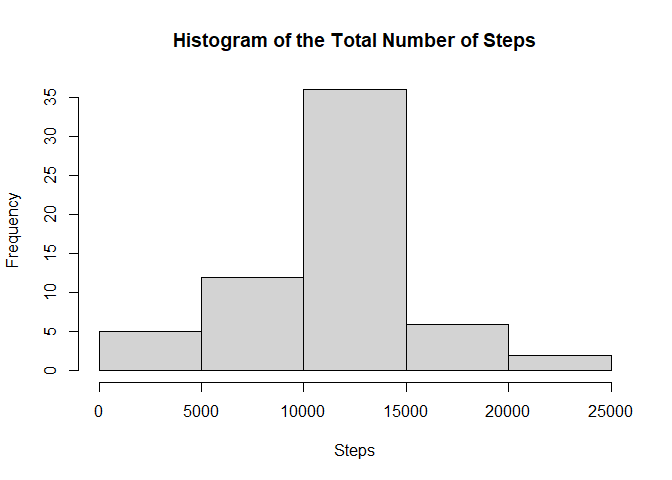
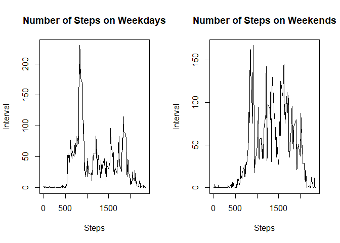

PA1\_template.md
================

This file contains my submitted assignment for Reproducible Research -
Week 2\` project.

# Loading the data

``` r
unzip(zipfile = "activity.zip")
activity <- read.csv("activity.csv")
activity$date <- as.Date(activity$date)
```

# What is mean total number of steps taken per day?

Calculating the total number of steps taken per day

``` r
steps.per.day <- aggregate(steps ~ date, activity, sum, na.rm=TRUE)
print(steps.per.day)
```

    ##          date steps
    ## 1  2012-10-02   126
    ## 2  2012-10-03 11352
    ## 3  2012-10-04 12116
    ## 4  2012-10-05 13294
    ## 5  2012-10-06 15420
    ## 6  2012-10-07 11015
    ## 7  2012-10-09 12811
    ## 8  2012-10-10  9900
    ## 9  2012-10-11 10304
    ## 10 2012-10-12 17382
    ## 11 2012-10-13 12426
    ## 12 2012-10-14 15098
    ## 13 2012-10-15 10139
    ## 14 2012-10-16 15084
    ## 15 2012-10-17 13452
    ## 16 2012-10-18 10056
    ## 17 2012-10-19 11829
    ## 18 2012-10-20 10395
    ## 19 2012-10-21  8821
    ## 20 2012-10-22 13460
    ## 21 2012-10-23  8918
    ## 22 2012-10-24  8355
    ## 23 2012-10-25  2492
    ## 24 2012-10-26  6778
    ## 25 2012-10-27 10119
    ## 26 2012-10-28 11458
    ## 27 2012-10-29  5018
    ## 28 2012-10-30  9819
    ## 29 2012-10-31 15414
    ## 30 2012-11-02 10600
    ## 31 2012-11-03 10571
    ## 32 2012-11-05 10439
    ## 33 2012-11-06  8334
    ## 34 2012-11-07 12883
    ## 35 2012-11-08  3219
    ## 36 2012-11-11 12608
    ## 37 2012-11-12 10765
    ## 38 2012-11-13  7336
    ## 39 2012-11-15    41
    ## 40 2012-11-16  5441
    ## 41 2012-11-17 14339
    ## 42 2012-11-18 15110
    ## 43 2012-11-19  8841
    ## 44 2012-11-20  4472
    ## 45 2012-11-21 12787
    ## 46 2012-11-22 20427
    ## 47 2012-11-23 21194
    ## 48 2012-11-24 14478
    ## 49 2012-11-25 11834
    ## 50 2012-11-26 11162
    ## 51 2012-11-27 13646
    ## 52 2012-11-28 10183
    ## 53 2012-11-29  7047

Making a histogram of the total number of steps taken each day.

``` r
plot1<- hist(steps.per.day$steps, main = "Histogram of the total number of steps per day",
     col = "yellow", xlab = "Steps", ylim = c(0, 30))
```

<!-- -->

``` r
dev.off()
```

    ## null device 
    ##           1

Calculating and reporting the mean of the total number of steps taken
per day

``` r
mean.steps.per.day <- mean(steps.per.day$steps, na.rm = TRUE)
print(mean.steps.per.day)
```

    ## [1] 10766.19

Calculating and reporting the median of the total number of steps taken
per day

``` r
median.steps.per.day <- median(steps.per.day$steps, na.rm = TRUE)
print(median.steps.per.day)
```

    ## [1] 10765

# What is the average daily activity pattern?

Showing the average daily activity pattern, using a time series plot of
the 5-minute interval and the average number of steps taken, averaged
across all days.

``` r
stepsPerInterval <-aggregate(steps~interval, data=activity, mean, na.rm=TRUE)
plot2<- plot(steps~interval, data=stepsPerInterval, type="l",
     xlab = "5-minute interval", ylab = "Avarage Number of Steps", main = "Daily activity pattern of intervals and average number of steps")
```

<!-- -->

``` r
dev.off()
```

    ## null device 
    ##           1

Showing the 5-minute interval with the maximum number of steps, on
average across all the days in the data set.

``` r
max_steps <- stepsPerInterval[which.max(stepsPerInterval$steps),]$interval
print(max_steps)
```

    ## [1] 835

# Imputing missing values

Calculating and reporting the total number of missing values in the data
set.

``` r
missing <- sum(is.na(activity$steps))
print(missing)
```

    ## [1] 2304

Filling in all of the missing values in the data set, using mean number
of steps per interval.

``` r
activity_without_NA <- activity  
for (i in 1:nrow(activity)){
        if(is.na(activity$steps[i])){
                activity_without_NA$steps[i]<- stepsPerInterval$steps[activity_without_NA$interval[i] == stepsPerInterval$interval]
        }
}
```

Making a histogram of the total number of steps taken each day.

``` r
library(dplyr)
```

    ## Warning: package 'dplyr' was built under R version 4.1.3

    ## 
    ## Attaching package: 'dplyr'

    ## The following objects are masked from 'package:stats':
    ## 
    ##     filter, lag

    ## The following objects are masked from 'package:base':
    ## 
    ##     intersect, setdiff, setequal, union

``` r
stepsPerDay <- activity_without_NA %>%
        group_by(date) %>%
        summarize(sumsteps = sum(steps, na.rm = TRUE)) 

plot3<- hist(stepsPerDay$sumsteps, main = "Histogram of the Total Number of Steps", 
    xlab="Steps")
```

<!-- -->

``` r
dev.off()
```

    ## null device 
    ##           1

Calculating and reporting the mean and median total number of steps
taken per day.

``` r
mean <- round(mean(stepsPerDay$sumsteps), digits = 2)
median <- round(median(stepsPerDay$sumsteps), digits = 2)
print(mean)
```

    ## [1] 10766.19

``` r
print(median)
```

    ## [1] 10766.19

Comparing old and new mean and median.

``` r
Compare <- data.frame(mean = c(mean.steps.per.day,mean),median = c(median.steps.per.day,median))
rownames(Compare) <- c("Pre NA Transformation", "Post NA Transformation")
print(Compare)
```

    ##                            mean   median
    ## Pre NA Transformation  10766.19 10765.00
    ## Post NA Transformation 10766.19 10766.19

Regarding mean total number of steps, the value is exaxtly same as the
estimates from the first part of the assignment. The mean differs
slightly, originally being 10765, and now plus added 1.19.There was zero
impact of imputing missing data on the estimates of the mean total daily
number of steps, because it was filled with mean number. Contrary, it
had slight impact on median, as mean was slightly higher, therefore
increasing median.

# Are there differences in activity patterns between weekdays and weekends?

Creating a new factor variable in the data set with two levels –
“weekday” and “weekend” indicating whether a given date is a weekday or
weekend day.

``` r
activity_without_NA$date <- as.Date(activity_without_NA$date)
activity_without_NA$day <- weekdays(activity_without_NA$date)
for (i in 1:nrow(activity_without_NA)) {
  if (activity_without_NA[i,]$day %in% c("sobota", "neděle")) {
      activity_without_NA[i,]$day<- "weekend"
  } 
  else{
      activity_without_NA[i,]$day <- "weekday"
    }
}
```

Making a panel plot containing a time series plot of the 5-minute
interval and the average number of steps taken, averaged across all
weekday days or weekend days (y-axis).

``` r
Weekday_activity <- filter(activity_without_NA, activity_without_NA$day == "weekday")
Weekend_activity <- filter(activity_without_NA, activity_without_NA$day == "weekend")

Weekday_activity <- Weekday_activity %>%
        group_by(interval) %>%
        summarize(steps = mean(steps)) 
Weekday_activity$day <- "weekday"

Weekend_activity <- Weekend_activity %>%
        group_by(interval) %>%
        summarize(steps = mean(steps)) 
Weekend_activity$day <- "weekend"

plot3<- par(mfcol = c(1,2))
plot(Weekday_activity$interval, Weekday_activity$steps,
     type = "l",
     xlab = "Steps",
     ylab = "Interval",
     main = "Number of Steps on Weekdays")
plot(Weekend_activity$interval, Weekend_activity$steps,
     type = "l",
     xlab = "Steps",
     ylab = "Interval",
     main = "Number of Steps on Weekends")
```

<!-- -->

``` r
dev.off()
```

    ## null device 
    ##           1
